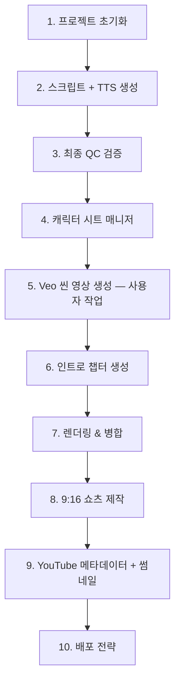
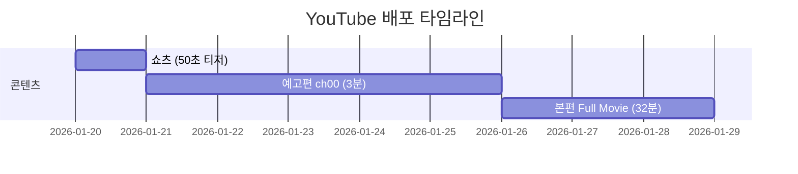

# Bible Animation Production Pipeline

> 프로젝트 기반 장편 바이블 애니메이션 제작 워크플로우

---

## 전체 프로덕션 흐름



---

## Phase 1 — 프로젝트 초기화

```bash
python -m api.production.project_manager create \
  --title "david_and_goliath" \
  --scripture "1 Samuel 16-31, 2 Samuel 5"
```

**결과물:**
- `project.json` — 챕터 구조, 타겟 시간, 핵심 이벤트
- `character_db.json` — 등장인물 DB (이름, 설명, 관계)
- 챕터 디렉토리 구조 (`ch00_introduction/` ~ `ch12_outro/`)

**규칙:**
- `ch00` (인트로)는 이 단계에서 디렉토리만 생성, 콘텐츠는 마지막에
- 각 챕터의 `key_events`, `scripture_range`, `duration_target` 정의

---

## Phase 2 — 스크립트 + TTS 일괄 생성

**인트로를 제외한** 모든 챕터(ch01 ~ chN)에 대해 순차 실행:

```bash
# 챕터별 개별 실행
python -m api.production.orchestrator --project david_and_goliath --chapter 1
python -m api.production.orchestrator --project david_and_goliath --chapter 2
# ... ch12까지
```

**각 챕터에서 수행되는 작업 (`run(mode="full")`):**

| 단계 | 작업 | 결과물 |
|------|------|--------|
| 1. Script Generation | Gemini로 에피소드 스크립트 생성 (5-8초/씬) | `script.json` |
| 2. Character Sheets | 주요 캐릭터 개별 시트 + 나머지 그룹 시트 | `character_sheets/*.png` |
| 3. TTS Generation | Edge-TTS 나레이션 + VTT 자막 | `assets/audio_NNN.mp3`, `.vtt` |
| 4. Scene Prompts | Veo용 씬 프롬프트 생성 | `scene_prompts.txt`, `scene_prompts2.txt` |

> **Note:** `scene_prompts2.txt`는 Veo 복붙용 한 줄 프롬프트 형식으로 별도 생성됨

> **캐릭터 시트**는 이 단계에서 챕터별로 기본 생성되지만, Phase 4의 캐릭터 매니저를 통해 크로스-챕터 일괄 관리를 수행하면 더 높은 일관성을 확보할 수 있음

**핵심 제약:**
- 씬당 **최대 8초** (Veo 제한)
- 나레이션 **15-20 단어** 이하/씬
- 이전 챕터 요약이 context로 전달되어 스토리 연속성 유지

---

## Phase 3 — 최종 QC 검증

모든 챕터의 스크립트 + TTS가 완료된 후, **일괄 검증** 실행:

```bash
python -m api.production.orchestrator --project david_and_goliath --validate
```

### 검증 항목

#### 파일 무결성
- [ ] 모든 챕터에 `script.json` 존재
- [ ] 모든 챕터에 `scene_prompts.txt` 존재
- [ ] MP3 파일 수 = 씬 수 (0바이트 파일 없음)
- [ ] VTT 파일 수 = 씬 수

#### 씬 Duration 검증
- [ ] 모든 씬의 `duration` ≤ 8초
- [ ] 각 챕터의 총 duration이 `duration_target`에 근접 (±10%)
- [ ] MP3 실제 재생 길이가 8초 이내인지 확인

#### 스토리 연속성
- [ ] 캐릭터 이름 일관성 (챕터 간 동일 인물이 다른 이름으로 등장하는지)
- [ ] 시간순 연속성 (이전 챕터에서 죽은 인물이 이후에 재등장하지 않는지)

#### 통계 리포트
```
프로젝트: David and Goliath
총 챕터: 12 (인트로 제외)
총 씬: 262
총 Duration: ~31분
챕터별: ch01(21씬/150s), ch02(17씬/120s), ...
8초 초과 씬: 0개
누락 파일: 0개
```

---

## Phase 4 — 캐릭터 시트 매니저

전체 스크립트를 분석하여 **시대/연령별로 적합한 캐릭터 시트**를 일괄 생성:

```bash
python -m api.production.character_manager --project david_and_goliath
```

### 동작 원리

#### 1단계: 캐릭터 타임라인 분석

모든 `script.json`을 읽어 캐릭터별 등장 패턴을 분석:

```json
{
  "DAVID": {
    "total_appearances": 85,
    "phases": [
      { "era": "shepherd_boy", "age": "~15-17", "chapters": [1, 2, 3] },
      { "era": "fugitive_warrior", "age": "~20-28", "chapters": [4, 5, 6, 7, 8, 9] },
      { "era": "king", "age": "~30+", "chapters": [10, 11, 12] }
    ]
  },
  "GOLIATH": {
    "total_appearances": 15,
    "phases": [
      { "era": "single", "chapters": [2, 3] }
    ]
  }
}
```

#### 2단계: Visual Anchor 생성

Gemini를 사용하여 각 캐릭터의 시대별 **고정 외형 설명** 생성:

```json
{
  "GOLIATH_single": "A towering 9-foot Philistine warrior with dark bronze skin, thick black braided beard reaching his chest, deep-set brown eyes with heavy brow ridge..."
}
```

#### 3단계: 시트 생성 전략

| 상황 | 전략 | 예시 |
|------|------|------|
| 같은 시대 (동일 전투 등) | **1장 생성 → 해당 챕터에 복사** | 골리앗: ch02 = ch03 |
| 시대 변화 (성장/노화) | **시대별 1장씩** | 다윗: 소년 / 전사 / 왕 |
| 단역 (1-2회 등장) | **그룹 시트** | 나발의 하인들 |

#### 4단계: 씬 프롬프트 업데이트

각 챕터의 `scene_prompts.txt`에 visual anchor 텍스트를 주입하여 재생성:

```
기존: "David stands before Goliath..."
갱신: "David (young shepherd boy, ~16, ruddy skin, reddish-brown
       curly hair, simple wool tunic) stands before Goliath
       (9-foot warrior, dark bronze skin, thick black braided
       beard, bronze scale armor)..."
```

#### 결과물

```
project/
├── character_timeline.json          ← 전체 타임라인
├── character_visual_anchors.json    ← 고정 외형 설명
└── chNN_xxx/
    ├── character_sheets/
    │   ├── DAVID_shepherd_x12_ref.png
    │   ├── GOLIATH_x7_ref.png       ← ch02와 동일 파일
    │   └── character_metadata.json
    └── scene_prompts.txt            ← visual anchor가 주입된 버전
```

---

## Phase 5 — Veo 씬 영상 생성 (사용자 수동 작업)

캐릭터 시트 + 업데이트된 scene_prompts를 참고하여 **Veo에서 씬 영상 생성**:

```
각 챕터의 scenes/ 디렉토리에 배치:
  ch01_xxx/scenes/scene_001.mp4
  ch01_xxx/scenes/scene_002.mp4
  ...
```

**작업 가이드:**
- `scene_prompts.txt` 또는 `scene_prompts2.txt`(한 줄 프롬프트)를 Veo에 입력
- 해당 챕터의 `character_sheets/` 이미지를 레퍼런스로 첨부하여 캐릭터 일관성 유지
- 각 씬 영상은 **8초 이내**
- 파일명: 다양한 형식 지원 — 렌더링 시 자동 정규화됨 (`normalize_scene_files`)

**파일명 자동 정규화:**

| 입력 형식 | 변환 결과 |
|-----------|----------|
| `Scene_1_objects_1080p_abc.mp4` (Veo 다운로드) | `scene_001.mp4` |
| `scene_1.mp4`, `scene 1.mp4` | `scene_001.mp4` |
| `1.mp4`, `01.mp4` | `scene_001.mp4` |
| `P01_scene_3.mp4` | `scene_003.mp4` |

---

## Phase 6 — 인트로 챕터 생성

모든 본편 챕터의 영상이 완성된 후, 인트로를 제작합니다.

### 6-1. 스크립트 + TTS 생성

```bash
python -m api.production.orchestrator --project david_and_goliath --chapter 0
```

- ch00용 인트로 스크립트(`script.json`)와 TTS 오디오(`assets/`)가 자동 생성됩니다.

### 6-2. 인트로 자동 조립 (Auto-Assembly)

Veo로 새 영상을 만들 필요 없이, **기존 챕터(ch01-ch12)의 씬 영상을 자동으로 매칭**하여 인트로를 조립합니다:

```bash
python -m api.production.orchestrator --project david_and_goliath --assemble-intro
```

**동작 원리:**

1. `intro_manual_map.json`이 있으면 **PD 큐레이션 매핑 우선** — 각 인트로 씬에 대해 수동 지정된 소스 씬 사용
2. 매핑이 없는 씬은 ch01-ch12의 모든 씬과 **의미적 유사도** (나레이션 텍스트, 캐릭터 겹침, 영상 프롬프트 키워드) 비교
3. 가장 잘 맞는 소스 씬의 영상을 ch00의 `scenes/` 디렉토리로 복사
4. 매핑 결과를 `intro_assembly_map.json`에 저장

**매칭 가중치:**

| 요소 | 가중치 | 설명 |
|------|--------|------|
| 나레이션 텍스트 유사도 | 40% | `SequenceMatcher` 기반 |
| 캐릭터 겹침 | 25% | Jaccard 유사도 |
| 키워드 겹침 (영상 프롬프트) | 35% | 정지어 제거 후 비교 |

> 동일 소스 씬의 재사용 시 0.3점 감점 (다양한 씬 활용 유도)

### 6-3. 인트로 렌더링

자동 조립 완료 후, 일반 챕터와 동일하게 렌더링:

```bash
python -m api.production.orchestrator \
  --project david_and_goliath --chapter 0 --resume-chapter
```

- ch00 자체 TTS 나레이션이 소스 영상 위에 오버레이됩니다
- 구독/좋아요/알림 CTA 포함
- 전체 스토리 오버뷰 제공

---

## Phase 7 — 렌더링 & 병합

### 7-1. 오디오 우선순위 설정 (선택)

Veo 3.1에서 캐릭터가 대사를 치는 씬은 TTS를 덮어씌우면 안 됩니다:

```bash
# 특정 씬만 Veo 오디오 사용
python -m api.production.orchestrator \
  --project david_and_goliath --chapter 4 \
  --set-audio 3,5,7 veo

# 전체 씬에 적용
python -m api.production.orchestrator \
  --project david_and_goliath --chapter 4 \
  --set-audio all veo
```

**오디오 모드:**

| 모드 | 동작 | 사용 케이스 |
|------|------|------------|
| `tts` (기본) | TTS 나레이션 + VTT 자막 번인 | 나레이션 씬 |
| `veo` | Veo 원본 오디오 유지 + VTT 자막만 번인 | 대사/대화 씬 |
| `mix` | Veo 오디오(80%) + TTS(20%) 블렌딩 + VTT | 배경 대화 + 나레이션 |

> `script.json`의 `skip_tts: true`는 `audio_priority: "veo"`로 자동 변환 (하위 호환)

### 7-2. 챕터별 렌더링

```bash
python -m api.production.orchestrator \
  --project david_and_goliath --chapter N --resume-chapter
```

**렌더링 과정:**
1. 씬 파일 자동 정규화 (`normalize_scene_files`)
2. 누락 TTS가 있으면 자동 재생성
3. 씬별 렌더링: 영상 + 오디오(모드별) + VTT 자막 합성 → `clips/`
4. 모든 클립 → 챕터 마스터 영상 병합

### 7-3. 전체 프로젝트 병합

```bash
python -m api.production.orchestrator \
  --project david_and_goliath --merge-project
```

- 모든 챕터 영상을 연결하여 최종 마스터 영상 생성
- YouTube 메타데이터 자동 생성 (제목, 설명, 챕터 타임스탬프)

---

## Phase 8 — 9:16 쇼츠 제작

쇼츠는 **두 가지 유형**이 있습니다:

| 유형 | 소스 | 시간 | 용도 |
|------|------|------|------|
| **A. 챕터 풀 쇼츠** | 챕터 전체를 9:16으로 | 챕터별 상이 | 챕터 단위 마케팅 |
| **B. 큐레이션 쇼츠** | ch00에서 하이라이트 선별 | ~50-60초 | 예고편/티저 |

### A. 챕터 풀 쇼츠 (기존 방식)

1. **9:16 Veo 영상 준비** — 사용자가 세로형(9:16)으로 별도 촬영/생성
2. **`scenes_shorts/`에 배치** — 기존 `scenes/`와 동일 구조
3. **`--shorts` 렌더링 실행** — TTS 재사용, 영상만 9:16 해상도

```bash
python -m api.production.orchestrator \
  --project david_and_goliath --chapter N --resume-chapter --shorts
```

| 항목 | 16:9 (기본) | 9:16 (쇼츠) |
|------|-------------|-------------|
| script.json | ✅ 공유 | ✅ 공유 |
| TTS (assets/) | ✅ 공유 | ✅ 공유 |
| 씬 영상 | `scenes/` | `scenes_shorts/` |
| 렌더 클립 | `clips/` | `clips_shorts/` |
| 최종 출력 | `chapter.mp4` | `chapter_shorts.mp4` |

### B. 큐레이션 쇼츠 (ch00 기반)

ch00 인트로에서 **가장 임팩트 있는 씬만 선별**하여 50-60초 쇼츠를 제작합니다.

#### 준비 파일 구조

```
ch00_introduction/
├── shorts_script.json         ← 큐레이션 씬 선택 + 편집 가이드
├── scene_prompts_shorts.txt   ← 9:16 Veo 벌크 프롬프트
├── shorts_metadata.json       ← YouTube Shorts 메타데이터
└── assets_shorts/             ← 쇼츠 전용 TTS + VTT
    ├── asset_mapping.json     ← 씬별 에셋 매핑
    ├── shorts_audio_001.mp3   ← Scene 1 (무음 placeholder, Hook)
    ├── shorts_audio_002.mp3   ← Scene 2 (원본 ch00 씬에서 복사)
    ├── ...
    └── shorts_audio_008.mp3   ← Scene 8 (CTA 대사 포함)
```

#### 쇼츠 구조 (50-60초)

| 시간 | 구간 | 내용 |
|------|------|------|
| 00-03s | **Hook** | 가장 임팩트 있는 장면 + 효과음. 자막: "역사를 바꾼 1분의 선택" |
| 03-50s | **Story** | 챕터별 핵심 서사 7씬. 긴박한 교차 편집 + 핵심 대사 자막 |
| 마지막 씬 | **CTA (대사)** | 나레이션에 "Double tap / Watch full movie on our profile" 포함 |

> **CTA 전략:** 쇼츠에서는 Subscribe/Profile 클릭이 불가능하므로 별도 CTA 오버레이 씬 불필요. 마지막 씬 나레이션에 더블탭(좋아요) 유도 + 프로필 안내 대사만 포함.

#### 씬 선택 기준

| 위치 | 선택 기준 | 예시 |
|------|----------|------|
| Hook (1씬) | 전체에서 가장 드라마틱/임팩트 있는 순간 | 골리앗 피격 |
| Story (6-7씬) | 서사 아크를 보여주는 핵심 장면들 | 양치기→기름부음→전투→배신→자비→즉위 |
| 마지막 씬 | 클라이맥스 + CTA 대사 추가 | 왕 즉위 + "Double tap if this blessed you" |

#### 조립 방식 (씬별)

| 씬 유형 | 영상 오디오 | TTS | 자막 |
|---------|-----------|-----|------|
| Hook | ✅ Veo 원본 사용 (이펙트) | ❌ 없음 | 텍스트 오버레이만 |
| Story | ❌ 뮤트 | ✅ TTS 나레이션 | VTT 자막 번인 |

#### 9:16 프롬프트 작성 규칙

`scene_prompts_shorts.txt`는 `scene_prompts2.txt`와 **동일한 벌크 포맷**:

```
Scene N: Objects: ... Action: ... Style: ... Camera: ... Atmosphere: ... SFX: ... Negative: ...
```

16:9 → 9:16 변환 시 구도 적응:

| 원본 구도 | 9:16 적응 |
|-----------|----------|
| 와이드 풍경 | 세로 포트레이트 (캐릭터 60% + 환경) |
| 캐릭터 등장 | 로우앵글 올려다보기 (세로 프레임 꽉 채움) |
| 기름부음 | 위에서 아래로 기름 흐름 + 신성한 빛 |
| 동굴 씬 | 키아로스쿠로 (위에서 빛 한 줄기) |
| 액션 (창 던지기) | 대각선 액션샷 (위→아래 궤적) |
| 즉위 | 세레모니 샷 (위에서 왕관 내려옴) |

**필수 네거티브:** `horizontal composition, landscape orientation, 16:9 framing`

### CTA (Call-to-Action) — 16:9 본편 전용

**16:9 본편**에만 CTA 오버레이가 적용됩니다:

- `data/cta/cta_veo_greenscreen.mp4` — Veo로 생성된 녹색 배경 CTA 영상
- FFmpeg `chromakey` 필터로 녹색 배경을 투명화
- 인트로 렌더링 시 자동 적용 (`_apply_universal_cta()`)

> **쇼츠에는 CTA 오버레이를 사용하지 않음.** 더블탭 유도 + 프로필 안내는 나레이션 대사로만 처리.

---

## Phase 9 — YouTube 메타데이터 + 썸네일 생성

### 9-1. 메타데이터 생성

```bash
python -m api.production.orchestrator --project david_and_goliath --generate-metadata
```

### YouTube SEO 가이드라인 (자동 적용)

Gemini 프롬프트에 아래 규칙이 내장되어 있음 (`ai.py`):

| 항목 | 규칙 |
|------|------|
| **제목** | 액션/여정 문구 사용 ("From Shepherd to King"), 70자 이내, 검색 키워드 맨 앞 |
| **서브타이틀** | **"Bible Stories for Kids and Adults" 필수** 포함 (검색 폭 확장) |
| **설명** | Hook → WHAT YOU'LL DISCOVER → CHAPTERS → KEY BIBLE VERSES → CTA |
| **해시태그** | **스토리에 등장하지 않는 캐릭터/테마 금지** (예: #Jesus가 없는 스토리에 #Jesus 금지) |
| **해시태그** | 포맷 (#3danimation), 오디언스 (#biblestoriesforkids), 트렌딩 (#faithoverfear) 포함 |
| **태그** | 롱테일 키워드 포함 ("Bible Stories for Kids", "Full Movie") |

> Ark Films 채널 (83K+ 조회수) 분석 기반으로 검증된 키워드 전략

### 생성 대상별 메타데이터

| 대상 | 제목 | 설명 | 해시태그 | 저장 위치 |
|------|------|------|---------|----------|
| **전체 영상** (본편) | 3개 | ✅ 챕터 타임스탬프 포함 | 20+ | `final/metadata.json` |
| **예고편** (ch00) | 3개 | ✅ 본편 링크 CTA 포함 | 20+ | `ch00_xxx/metadata.json` |
| **쇼츠** (ch00 기반) | 3개 | ✅ 고정 댓글 템플릿 | 15+ (#Shorts 포함) | `ch00_xxx/shorts_metadata.json` |

### 예고편 메타데이터 특수 필드

`ch00_xxx/metadata.json`에는 예고편 전용 필드가 포함:

```json
{
  "video_type": "trailer",
  "full_movie_cta": "🎥 FULL MOVIE NOW AVAILABLE! Watch here: [LINK]",
  "publish_strategy": "본편 3-7일 전 공개, 고정 댓글에 본편 링크"
}
```

### 9-2. 썸네일 생성

```bash
python -m api.production.orchestrator --project david_and_goliath --generate-thumbnails
```

#### A/B 테스트 컨셉 (3종 자동 생성)

| Variant | 마케팅 앵글 | 예시 |
|---------|-----------|------|
| **A: EPIC/ACTION** | 전투 장면, 극적 대결 | 다윗 vs 골리앗 대치 |
| **B: EMOTIONAL/CHARACTER** | 클로즈업, 인물 여정 | 다윗의 결연한 눈빛 |
| **C: CURIOSITY/MYSTERY** | 궁금증 유발 구도 | "무슨 일이?" 느낌 |

#### 생성 과정

1. **Gemini 3 Flash** (`gemini-3-flash-preview`) → 3개 컨셉 생성 (제목 + Imagen 프롬프트 + 마케팅 앵글)
2. **Imagen 3** (`imagen-3.0-generate-002`) → 16:9 배경 이미지 생성
3. **Nano Banana Pro** (`gemini-3-pro-image-preview`) → 3D 메탈릭 골드 타이틀 텍스트 합성

> 텍스트 합성은 `composite_title_on_thumbnail()` (Nano Banana Pro 이미지 편집)으로 자동 처리. Canva/Photoshop 불필요.

## Phase 10 — 배포 전략

### 공개 순서



| 순서 | 콘텐츠 | 목적 |
|------|--------|------|
| 1️⃣ | **쇼츠 (50초)** | 알고리즘 노출, 채널 인지도 |
| 2️⃣ | **예고편 ch00 (3분)** | 본편 기대감 조성, 구독 유도 |
| 3️⃣ | **본편 (32분)** | 메인 콘텐츠, 시청 시간 확보 |

### 쇼츠 배포 메모

- 쇼츠에는 CTA 오버레이 **사용하지 않음** (클릭 불가)
- 유일한 CTA: **더블탭(좋아요)** 유도 + **프로필 안내** (나레이션 대사)
- 고정 댓글에 본편 링크 삽입
- 최적 게시 시간: 6-9 AM 또는 7-9 PM

### 예고편 배포 메모

- 본편 공개 **3-7일 전** 게시
- `metadata.json`의 `publish_strategy` 필드 참고
- 본편 공개 후 고정 댓글에 본편 링크 추가

---

## 디렉토리 구조 (최종)

```
data/projects/david_and_goliath/
├── project.json
├── character_db.json
├── character_timeline.json           ← Phase 4
├── character_visual_anchors.json     ← Phase 4
│
├── ch00_introduction/                ← Phase 6 (마지막 생성)
│   ├── script.json                   ← 인트로 스크립트 (27씬)
│   ├── scene_prompts.txt             ← 16:9 Veo 프롬프트
│   ├── scene_prompts2.txt            ← 16:9 벌크 프롬프트
│   ├── scene_prompts_shorts.txt      ← 9:16 쇼츠 벌크 프롬프트 (8씬)
│   ├── shorts_script.json            ← 쇼츠 구조/편집 가이드
│   ├── metadata.json                 ← 예고편 메타데이터
│   ├── shorts_metadata.json          ← 쇼츠 메타데이터
│   ├── assets/                       ← 16:9 TTS (27씬)
│   │   ├── audio_001.mp3
│   │   ├── audio_001.vtt
│   │   └── ...
│   ├── assets_shorts/                ← 쇼츠 전용 TTS (8씬)
│   │   ├── asset_mapping.json        ← 원본↔쇼츠 씬 매핑
│   │   ├── shorts_audio_001.mp3      ← Hook (무음 placeholder)
│   │   ├── shorts_audio_002.mp3      ← ch00 씬2에서 복사
│   │   ├── ...
│   │   └── shorts_audio_008.mp3      ← 즉위 + CTA 대사 (신규 TTS)
│   ├── character_sheets/
│   ├── scenes/                       ← 16:9 Veo 영상
│   └── scenes_shorts/                ← 9:16 Veo 영상
│
├── ch01_the_shepherd_king_chosen/     ← Phase 2
│   ├── script.json
│   ├── scene_prompts.txt
│   ├── scene_prompts2.txt
│   ├── assets/                       ← MP3 + VTT
│   ├── character_sheets/
│   ├── scenes/                       ← 16:9 Veo (Phase 5)
│   ├── scenes_shorts/                ← 9:16 Veo (Phase 8A)
│   ├── clips/                        ← 16:9 렌더링 (Phase 7)
│   ├── clips_shorts/                 ← 9:16 렌더링 (Phase 8A)
│   ├── chapter.mp4
│   └── chapter_shorts.mp4
│
├── ch02_the_giants_challenge/
│   └── ...
│
├── youtube_metadata.json              ← Phase 9 통합
└── final/                             ← Phase 7 최종 출력
    ├── master_{slug}.mp4
    ├── metadata.json                  ← 본편 메타데이터
    └── thumbnails/                    ← Phase 9-2 썸네일
        ├── concepts.json
        ├── variant_a.png
        ├── variant_b.png
        └── variant_c.png
```

---

## 명령어 요약

| Phase | 명령어 | 설명 |
|-------|--------|------|
| 1 | `project_manager create --title X --scripture Y` | 프로젝트 초기화 |
| 2 | `orchestrator --project X --chapter N` | 스크립트 + 캐릭터 시트 + TTS |
| 3 | `orchestrator --project X --validate` | 전체 QC 검증 |
| 4 | `character_manager --project X` | 크로스-챕터 캐릭터 시트 일괄 관리 |
| 5 | *(사용자 수동)* Veo 씬 영상 제작 | scene_prompts + 시트 참조 |
| 6a | `orchestrator --project X --chapter 0` | 인트로 스크립트 + TTS 생성 |
| 6b | `orchestrator --project X --assemble-intro` | 인트로 자동 조립 (기존 챕터 씬 활용) |
| 6c | `orchestrator --project X --chapter 0 --resume-chapter` | 인트로 렌더링 |
| 7a | `orchestrator --project X --chapter N --set-audio SCENES MODE` | 오디오 우선순위 설정 |
| 7b | `orchestrator --project X --chapter N --resume-chapter` | 챕터별 렌더링 (16:9) |
| 7c | `orchestrator --project X --merge-project` | 전체 병합 + 메타데이터 |
| 8a | `orchestrator --project X --chapter N --resume-chapter --shorts` | 챕터 풀 9:16 쇼츠 렌더링 |
| 8b | `orchestrator --project X --render-curation-shorts` | ch00 큐레이션 쇼츠 렌더링 |
| 9a | `orchestrator --project X --generate-metadata` | YouTube 메타데이터 일괄 생성 |
| 9b | `orchestrator --project X --generate-thumbnails` | A/B 테스트 썸네일 3종 (Imagen + Nano Banana Pro) |
| 9c | `orchestrator --project X --validate-quality` | AI 시각 품질 분석 (Gemini 3 Flash) |
| 10 | *(배포)* 쇼츠 → 예고편 → 본편 순서로 공개 | 배포 전략 실행 |

### 유틸리티

| 명령어 | 설명 |
|--------|------|
| `orchestrator --project X --project-status` | 프로젝트 상태 확인 |
| `orchestrator --project X --validate-quality` | AI 시각 품질 분석 (Gemini 3 Flash) |
| `orchestrator --char-sheet CHARACTER_ID` | 캐릭터 시트 프롬프트 출력 |
| `orchestrator --char-json CHARACTER_ID` | 캐릭터 JSON 메타데이터 출력 |
| `orchestrator --regen-prompts RUN_ID` | 기존 런의 프롬프트만 재생성 |
| `character_manager --project X --timeline-only` | 타임라인 분석만 실행 |
| `character_manager --project X --inject-only` | Visual Anchor 주입만 실행 |
