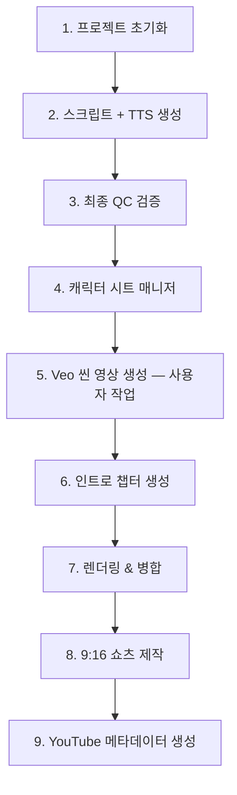

# Bible Animation Production Pipeline

> 프로젝트 기반 장편 바이블 애니메이션 제작 워크플로우

---

## 전체 프로덕션 흐름



---

## Phase 1 — 프로젝트 초기화

```bash
python -m api.production.project_manager create \
  --title "david_and_goliath" \
  --scripture "1 Samuel 16-31, 2 Samuel 5"
```

**결과물:**
- `project.json` — 챕터 구조, 타겟 시간, 핵심 이벤트
- `character_db.json` — 등장인물 DB (이름, 설명, 관계)
- 챕터 디렉토리 구조 (`ch00_introduction/` ~ `ch12_outro/`)

**규칙:**
- `ch00` (인트로)는 이 단계에서 디렉토리만 생성, 콘텐츠는 마지막에
- 각 챕터의 `key_events`, `scripture_range`, `duration_target` 정의

---

## Phase 2 — 스크립트 + TTS 일괄 생성

**인트로를 제외한** 모든 챕터(ch01 ~ chN)에 대해 순차 실행:

```bash
# 챕터별 개별 실행
python -m api.production.orchestrator --project david_and_goliath --chapter 1
python -m api.production.orchestrator --project david_and_goliath --chapter 2
# ... ch12까지
```

**각 챕터에서 수행되는 작업 (`run(mode="full")`):**

| 단계 | 작업 | 결과물 |
|------|------|--------|
| 1. Script Generation | Gemini로 에피소드 스크립트 생성 (5-8초/씬) | `script.json` |
| 2. Character Sheets | 주요 캐릭터 개별 시트 + 나머지 그룹 시트 | `character_sheets/*.png` |
| 3. TTS Generation | Edge-TTS 나레이션 + VTT 자막 | `assets/audio_NNN.mp3`, `.vtt` |
| 4. Scene Prompts | Veo용 씬 프롬프트 생성 | `scene_prompts.txt`, `scene_prompts2.txt` |

> **Note:** `scene_prompts2.txt`는 Veo 복붙용 한 줄 프롬프트 형식으로 별도 생성됨

> **캐릭터 시트**는 이 단계에서 챕터별로 기본 생성되지만, Phase 4의 캐릭터 매니저를 통해 크로스-챕터 일괄 관리를 수행하면 더 높은 일관성을 확보할 수 있음

**핵심 제약:**
- 씬당 **최대 8초** (Veo 제한)
- 나레이션 **15-20 단어** 이하/씬
- 이전 챕터 요약이 context로 전달되어 스토리 연속성 유지

---

## Phase 3 — 최종 QC 검증

모든 챕터의 스크립트 + TTS가 완료된 후, **일괄 검증** 실행:

```bash
python -m api.production.orchestrator --project david_and_goliath --validate
```

### 검증 항목

#### 파일 무결성
- [ ] 모든 챕터에 `script.json` 존재
- [ ] 모든 챕터에 `scene_prompts.txt` 존재
- [ ] MP3 파일 수 = 씬 수 (0바이트 파일 없음)
- [ ] VTT 파일 수 = 씬 수

#### 씬 Duration 검증
- [ ] 모든 씬의 `duration` ≤ 8초
- [ ] 각 챕터의 총 duration이 `duration_target`에 근접 (±10%)
- [ ] MP3 실제 재생 길이가 8초 이내인지 확인

#### 스토리 연속성
- [ ] 캐릭터 이름 일관성 (챕터 간 동일 인물이 다른 이름으로 등장하는지)
- [ ] 시간순 연속성 (이전 챕터에서 죽은 인물이 이후에 재등장하지 않는지)

#### 통계 리포트
```
프로젝트: David and Goliath
총 챕터: 12 (인트로 제외)
총 씬: 262
총 Duration: ~31분
챕터별: ch01(21씬/150s), ch02(17씬/120s), ...
8초 초과 씬: 0개
누락 파일: 0개
```

---

## Phase 4 — 캐릭터 시트 매니저

전체 스크립트를 분석하여 **시대/연령별로 적합한 캐릭터 시트**를 일괄 생성:

```bash
python -m api.production.character_manager --project david_and_goliath
```

### 동작 원리

#### 1단계: 캐릭터 타임라인 분석

모든 `script.json`을 읽어 캐릭터별 등장 패턴을 분석:

```json
{
  "DAVID": {
    "total_appearances": 85,
    "phases": [
      { "era": "shepherd_boy", "age": "~15-17", "chapters": [1, 2, 3] },
      { "era": "fugitive_warrior", "age": "~20-28", "chapters": [4, 5, 6, 7, 8, 9] },
      { "era": "king", "age": "~30+", "chapters": [10, 11, 12] }
    ]
  },
  "GOLIATH": {
    "total_appearances": 15,
    "phases": [
      { "era": "single", "chapters": [2, 3] }
    ]
  }
}
```

#### 2단계: Visual Anchor 생성

Gemini를 사용하여 각 캐릭터의 시대별 **고정 외형 설명** 생성:

```json
{
  "GOLIATH_single": "A towering 9-foot Philistine warrior with dark bronze skin, thick black braided beard reaching his chest, deep-set brown eyes with heavy brow ridge..."
}
```

#### 3단계: 시트 생성 전략

| 상황 | 전략 | 예시 |
|------|------|------|
| 같은 시대 (동일 전투 등) | **1장 생성 → 해당 챕터에 복사** | 골리앗: ch02 = ch03 |
| 시대 변화 (성장/노화) | **시대별 1장씩** | 다윗: 소년 / 전사 / 왕 |
| 단역 (1-2회 등장) | **그룹 시트** | 나발의 하인들 |

#### 4단계: 씬 프롬프트 업데이트

각 챕터의 `scene_prompts.txt`에 visual anchor 텍스트를 주입하여 재생성:

```
기존: "David stands before Goliath..."
갱신: "David (young shepherd boy, ~16, ruddy skin, reddish-brown
       curly hair, simple wool tunic) stands before Goliath
       (9-foot warrior, dark bronze skin, thick black braided
       beard, bronze scale armor)..."
```

#### 결과물

```
project/
├── character_timeline.json          ← 전체 타임라인
├── character_visual_anchors.json    ← 고정 외형 설명
└── chNN_xxx/
    ├── character_sheets/
    │   ├── DAVID_shepherd_x12_ref.png
    │   ├── GOLIATH_x7_ref.png       ← ch02와 동일 파일
    │   └── character_metadata.json
    └── scene_prompts.txt            ← visual anchor가 주입된 버전
```

---

## Phase 5 — Veo 씬 영상 생성 (사용자 수동 작업)

캐릭터 시트 + 업데이트된 scene_prompts를 참고하여 **Veo에서 씬 영상 생성**:

```
각 챕터의 scenes/ 디렉토리에 배치:
  ch01_xxx/scenes/scene_001.mp4
  ch01_xxx/scenes/scene_002.mp4
  ...
```

**작업 가이드:**
- `scene_prompts.txt` 또는 `scene_prompts2.txt`(한 줄 프롬프트)를 Veo에 입력
- 해당 챕터의 `character_sheets/` 이미지를 레퍼런스로 첨부하여 캐릭터 일관성 유지
- 각 씬 영상은 **8초 이내**
- 파일명: 다양한 형식 지원 — 렌더링 시 자동 정규화됨 (`normalize_scene_files`)

**파일명 자동 정규화:**

| 입력 형식 | 변환 결과 |
|-----------|----------|
| `Scene_1_objects_1080p_abc.mp4` (Veo 다운로드) | `scene_001.mp4` |
| `scene_1.mp4`, `scene 1.mp4` | `scene_001.mp4` |
| `1.mp4`, `01.mp4` | `scene_001.mp4` |
| `P01_scene_3.mp4` | `scene_003.mp4` |

---

## Phase 6 — 인트로 챕터 생성

모든 본편 챕터의 영상이 완성된 후, 인트로를 제작합니다.

### 6-1. 스크립트 + TTS 생성

```bash
python -m api.production.orchestrator --project david_and_goliath --chapter 0
```

- ch00용 인트로 스크립트(`script.json`)와 TTS 오디오(`assets/`)가 자동 생성됩니다.

### 6-2. 인트로 자동 조립 (Auto-Assembly)

Veo로 새 영상을 만들 필요 없이, **기존 챕터(ch01-ch12)의 씬 영상을 자동으로 매칭**하여 인트로를 조립합니다:

```bash
python -m api.production.orchestrator --project david_and_goliath --assemble-intro
```

**동작 원리:**

1. `intro_manual_map.json`이 있으면 **PD 큐레이션 매핑 우선** — 각 인트로 씬에 대해 수동 지정된 소스 씬 사용
2. 매핑이 없는 씬은 ch01-ch12의 모든 씬과 **의미적 유사도** (나레이션 텍스트, 캐릭터 겹침, 영상 프롬프트 키워드) 비교
3. 가장 잘 맞는 소스 씬의 영상을 ch00의 `scenes/` 디렉토리로 복사
4. 매핑 결과를 `intro_assembly_map.json`에 저장

**매칭 가중치:**

| 요소 | 가중치 | 설명 |
|------|--------|------|
| 나레이션 텍스트 유사도 | 40% | `SequenceMatcher` 기반 |
| 캐릭터 겹침 | 25% | Jaccard 유사도 |
| 키워드 겹침 (영상 프롬프트) | 35% | 정지어 제거 후 비교 |

> 동일 소스 씬의 재사용 시 0.3점 감점 (다양한 씬 활용 유도)

### 6-3. 인트로 렌더링

자동 조립 완료 후, 일반 챕터와 동일하게 렌더링:

```bash
python -m api.production.orchestrator \
  --project david_and_goliath --chapter 0 --resume-chapter
```

- ch00 자체 TTS 나레이션이 소스 영상 위에 오버레이됩니다
- 구독/좋아요/알림 CTA 포함
- 전체 스토리 오버뷰 제공

---

## Phase 7 — 렌더링 & 병합

### 7-1. 오디오 우선순위 설정 (선택)

Veo 3.1에서 캐릭터가 대사를 치는 씬은 TTS를 덮어씌우면 안 됩니다:

```bash
# 특정 씬만 Veo 오디오 사용
python -m api.production.orchestrator \
  --project david_and_goliath --chapter 4 \
  --set-audio 3,5,7 veo

# 전체 씬에 적용
python -m api.production.orchestrator \
  --project david_and_goliath --chapter 4 \
  --set-audio all veo
```

**오디오 모드:**

| 모드 | 동작 | 사용 케이스 |
|------|------|------------|
| `tts` (기본) | TTS 나레이션 + VTT 자막 번인 | 나레이션 씬 |
| `veo` | Veo 원본 오디오 유지 + VTT 자막만 번인 | 대사/대화 씬 |
| `mix` | Veo 오디오(80%) + TTS(20%) 블렌딩 + VTT | 배경 대화 + 나레이션 |

> `script.json`의 `skip_tts: true`는 `audio_priority: "veo"`로 자동 변환 (하위 호환)

### 7-2. 챕터별 렌더링

```bash
python -m api.production.orchestrator \
  --project david_and_goliath --chapter N --resume-chapter
```

**렌더링 과정:**
1. 씬 파일 자동 정규화 (`normalize_scene_files`)
2. 누락 TTS가 있으면 자동 재생성
3. 씬별 렌더링: 영상 + 오디오(모드별) + VTT 자막 합성 → `clips/`
4. 모든 클립 → 챕터 마스터 영상 병합

### 7-3. 전체 프로젝트 병합

```bash
python -m api.production.orchestrator \
  --project david_and_goliath --merge-project
```

- 모든 챕터 영상을 연결하여 최종 마스터 영상 생성
- YouTube 메타데이터 자동 생성 (제목, 설명, 챕터 타임스탬프)

---

## Phase 8 — 9:16 쇼츠 제작

각 챕터를 **9:16 세로형 쇼츠**로도 제작 가능합니다. 마케팅/SNS 배포용입니다.

### 워크플로우

1. **9:16 Veo 영상 준비** — 사용자가 세로형(9:16)으로 별도 촬영/생성
2. **`scenes_shorts/`에 배치** — 기존 `scenes/`와 동일 구조, 별도 디렉토리
3. **`--shorts` 렌더링 실행** — TTS는 재사용, 영상만 9:16 해상도로 렌더링

```bash
# 9:16 Veo 영상을 scenes_shorts/ 디렉토리에 배치 후:
python -m api.production.orchestrator \
  --project david_and_goliath --chapter N --resume-chapter --shorts
```

### 공유 vs 분리

| 항목 | 16:9 (기본) | 9:16 (쇼츠) |
|------|-------------|-------------|
| script.json | ✅ 공유 | ✅ 공유 |
| TTS (assets/) | ✅ 공유 | ✅ 공유 |
| 씬 영상 | `scenes/` | `scenes_shorts/` |
| 렌더 클립 | `clips/` | `clips_shorts/` |
| 최종 출력 | `chapter.mp4` | `chapter_shorts.mp4` |
| 해상도 | 1920×1080 | 1080×1920 |

> **Note:** `--shorts` 모드에서 TTS 생성은 건너뛰고 기존 `assets/`의 오디오를 재사용합니다.

### CTA (Call-to-Action) 오버레이

영상 끝에 **녹색 배경(Green Screen) CTA 영상**이 크로마키로 합성됩니다:

- `data/cta/cta_veo_greenscreen.mp4` — Veo로 생성된 녹색 배경 CTA 영상
- FFmpeg `chromakey` 필터로 녹색 배경을 투명화
- 인트로/쇼츠 모두에 자동 적용 (챕터 렌더링 시)
- 커스텀 위치/크기/투명도 조정 가능 (`_apply_universal_cta()`)

---

## Phase 9 — YouTube 메타데이터 생성

전체 프로젝트의 YouTube 배포에 필요한 메타데이터를 일괄 생성:

```bash
python -m api.production.orchestrator --project david_and_goliath --generate-metadata
```

### 생성 항목

| 대상 | 제목 | 썸네일 프롬프트 | 영상 설명 | 해시태그 | 저장 위치 |
|------|------|----------------|----------|---------|----------|
| 전체 프로젝트 | 3개 | 3개 | ✅ | ✅ | `final/metadata.json` |
| 인트로 (ch00) | 3개 | 3개 | ✅ | ✅ | `ch00_xxx/metadata.json` |
| 챕터별 쇼츠 | 1개 | 1개 | ✅ | ✅ | `chNN_xxx/shorts_metadata.json` |

### 출력 파일

- **`youtube_metadata.json`** — 프로젝트 루트에 전체 통합 메타데이터
- **`final/metadata.json`** — 전체 영상용 (제목×3, 썸네일×3, 설명, 해시태그)
- **`ch00_xxx/metadata.json`** — 인트로/예고편용
- **`chNN_xxx/shorts_metadata.json`** — 각 챕터 쇼츠용

## 디렉토리 구조 (최종)

```
data/projects/david_and_goliath/
├── project.json
├── character_db.json
├── character_timeline.json          ← Phase 4에서 생성
├── character_visual_anchors.json    ← Phase 4에서 생성
│
├── ch00_introduction/               ← Phase 6에서 생성 (마지막)
│   ├── script.json
│   ├── scene_prompts.txt
│   ├── assets/
│   └── scenes/
│
├── ch01_the_shepherd_king_chosen/    ← Phase 2에서 생성
│   ├── script.json                  ← 스크립트
│   ├── scene_prompts.txt            ← Phase 4에서 visual anchor 업데이트
│   ├── assets/                      ← MP3 + VTT
│   │   ├── audio_001.mp3
│   │   ├── audio_001.vtt
│   │   └── ...
│   ├── character_sheets/            ← Phase 4에서 시대별 생성
│   │   ├── DAVID_shepherd_x12_ref.png
│   │   ├── character_metadata.json
│   │   └── ...
│   ├── scenes/                      ← Phase 5 사용자 Veo 작업 (16:9)
│   │   ├── scene_001.mp4
│   │   └── ...
│   ├── scenes_shorts/               ← Phase 8 사용자 Veo 작업 (9:16)
│   │   ├── scene_001.mp4
│   │   └── ...
│   ├── clips/                       ← Phase 7 렌더링 결과 (16:9)
│   ├── clips_shorts/                ← Phase 8 렌더링 결과 (9:16)
│   ├── chapter.mp4                  ← 16:9 마스터
│   ├── chapter_shorts.mp4           ← 9:16 쇼츠
│   └── shorts_metadata.json         ← Phase 9 쇼츠 메타데이터
│
├── ch02_the_giants_challenge/
│   └── ...
│
├── youtube_metadata.json            ← Phase 9 통합 메타데이터
└── final/                           ← Phase 7 최종 출력
    ├── master_{slug}.mp4
    └── metadata.json                ← Phase 9 전체 영상 메타데이터
```

---

## 명령어 요약

| Phase | 명령어 | 설명 |
|-------|--------|------|
| 1 | `project_manager create --title X --scripture Y` | 프로젝트 초기화 |
| 2 | `orchestrator --project X --chapter N` | 스크립트 + 캐릭터 시트 + TTS |
| 3 | `orchestrator --project X --validate` | 전체 QC 검증 |
| 4 | `character_manager --project X` | 크로스-챕터 캐릭터 시트 일괄 관리 |
| 5 | *(사용자 수동)* Veo 씬 영상 제작 | scene_prompts + 시트 참조 |
| 6a | `orchestrator --project X --chapter 0` | 인트로 스크립트 + TTS 생성 |
| 6b | `orchestrator --project X --assemble-intro` | 인트로 자동 조립 (기존 챕터 씬 활용) |
| 6c | `orchestrator --project X --chapter 0 --resume-chapter` | 인트로 렌더링 |
| 7a | `orchestrator --project X --chapter N --set-audio SCENES MODE` | 오디오 우선순위 설정 |
| 7b | `orchestrator --project X --chapter N --resume-chapter` | 챕터별 렌더링 (16:9) |
| 7c | `orchestrator --project X --merge-project` | 전체 병합 + 메타데이터 |
| 8 | `orchestrator --project X --chapter N --resume-chapter --shorts` | 9:16 쇼츠 렌더링 |
| 9 | `orchestrator --project X --generate-metadata` | YouTube 메타데이터 일괄 생성 |

### 유틸리티

| 명령어 | 설명 |
|--------|------|
| `orchestrator --project X --project-status` | 프로젝트 상태 확인 |
| `orchestrator --char-sheet CHARACTER_ID` | 캐릭터 시트 프롬프트 출력 |
| `orchestrator --char-json CHARACTER_ID` | 캐릭터 JSON 메타데이터 출력 |
| `orchestrator --regen-prompts RUN_ID` | 기존 런의 프롬프트만 재생성 |
| `character_manager --project X --timeline-only` | 타임라인 분석만 실행 |
| `character_manager --project X --inject-only` | Visual Anchor 주입만 실행 |
